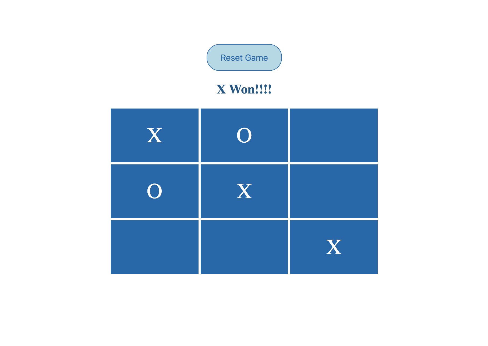

# Tic Tac Toe in WASM

This is a simple example for creating your first game in web assembly. The logic for this tic-tac-toe game is written in C++.



## Pre-requisites

Download and Install Emscripten

https://emscripten.org/docs/getting_started/downloads.html

## Build command for converting C++ files to .wasm & .js files

```emcc --bind -o tic_tac_toe.js tic_tac_toe.cpp```

## Install Live Server to deploy & view your changes

https://github.com/tapio/live-server#readme
